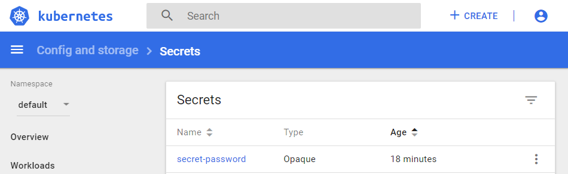
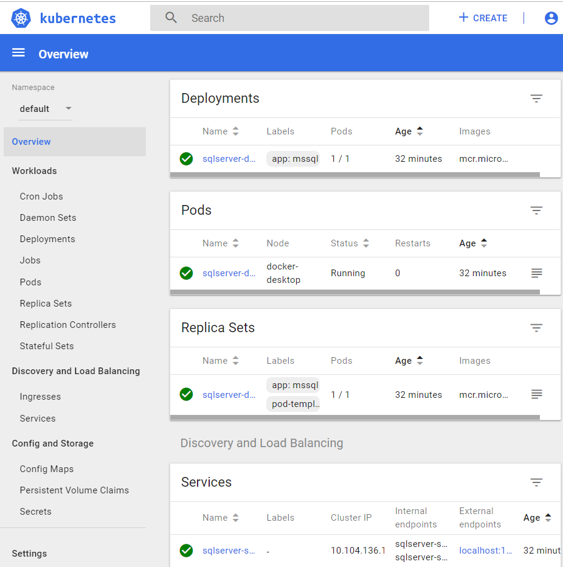
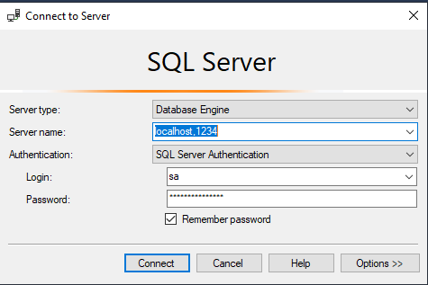

## README

### Setup Kubernetes cluster on local Windows machine

Click on Docker icon -> Settings -> Kubernetes -> Enable Kubernetes [Apply]

### Setup Kubernetes dashboard

1 Open a command prompt and enter `kubectl describe secret`
2 Copy the token
3 `kubectl apply -f https://raw.githubusercontent.com/kubernetes/dashboard/v1.10.1/src/deploy/recommended/kubernetes-dashboard.yaml`
4 `kubectl proxy`
5 Navigate to <http://localhost:8001/api/v1/namespaces/kube-system/services/https:kubernetes-dashboard:/proxy/#!/login>
6 Choose Token in Kubernetes Dashboard and paste in copied token

### Deploy a Sql Server container in your local Kubernetes cluster

1 Create a folder with the name `DeployToKubernetes`
2 Inside folder `DeployToKubernetes` create another folder with the name `SqlServer`
3 Add a `secret.yaml` file in the `SqlServer` folder

```yaml
kind: Secret
apiVersion: v1
metadata:
  name: secret-password
  namespace: default
data:
  # Password is P@ssword1$ so update it with password of your choice  
  SA_PASSWORD: "UEBzc3dvcmQxJA=="
type: Opaque`
```

4 Open a command prompt in the `SqlServer` folder and hit `kubectl apply -f secret.yaml`
5 Check in your Kubernetes dashboard if the secret-password has been created



6 Add a `deployment.yaml` file in the `SqlServer` folder

```yaml
apiVersion: apps/v1beta1
kind: Deployment
metadata:
  name: sqlserver-deployment
spec:
  replicas: 1
  template:
    metadata:
      labels:
        app: mssql
    spec:
      terminationGracePeriodSeconds: 10
      containers:
        - name: mssql
          image: mcr.microsoft.com/mssql/server:2017-latest
          ports:
          - containerPort: 1433
          env:
          - name: MSSQL_PID
            value: "Developer"
          - name: ACCEPT_EULA
            value: "Y"
          - name: SA_PASSWORD
            valueFrom:
              secretKeyRef:
                name: secret-password
                key: SA_PASSWORD
---

apiVersion: v1
kind: Service
metadata:
  name: sqlserver-service
spec:
  selector:
    app: mssql
  ports:
   - protocol: TCP
     port: 1234
     targetPort: 1433
  type: LoadBalancer
```

7 Open a command prompt in the `SqlServer` folder and hit `kubectl apply -f deployment.yaml`

8 Open the Kubernetes dashboard to check if your deployment and service is up and running



9 Open MSSQL Server Management Studio and connect to the SQLServer container running in your local K8S cluster

Server name: `localhost,1234`
Authentication: `SQL Server Authentication`
    Login: `sa`
    Password: `P@ssword1$`

